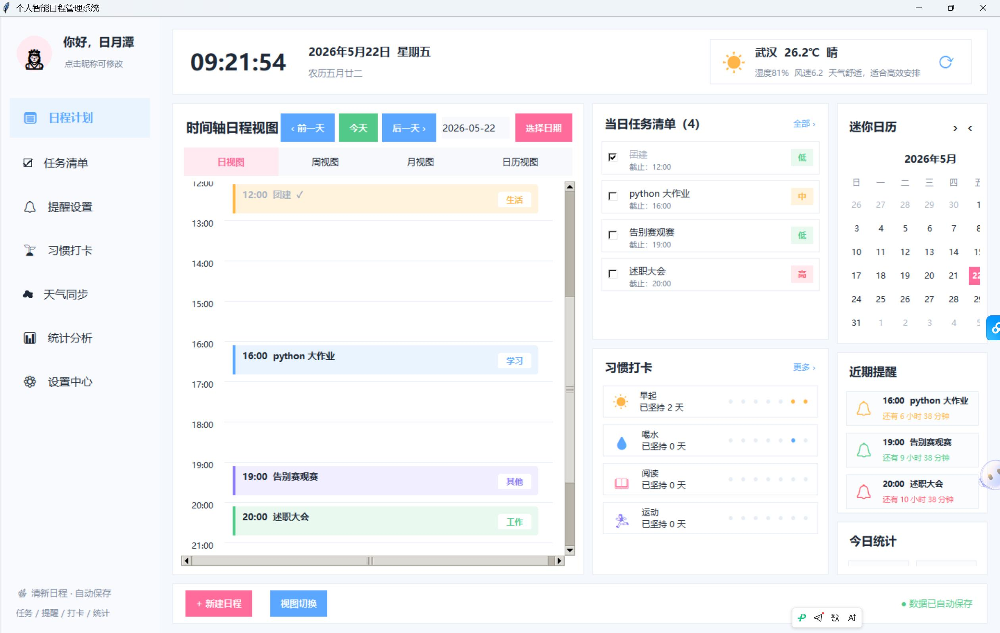
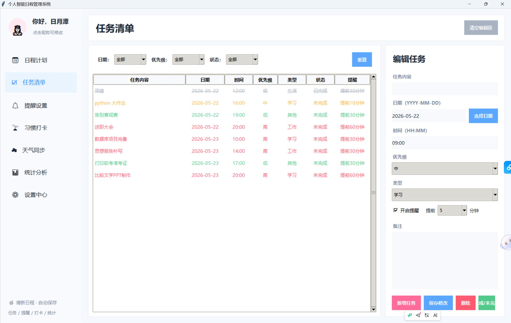
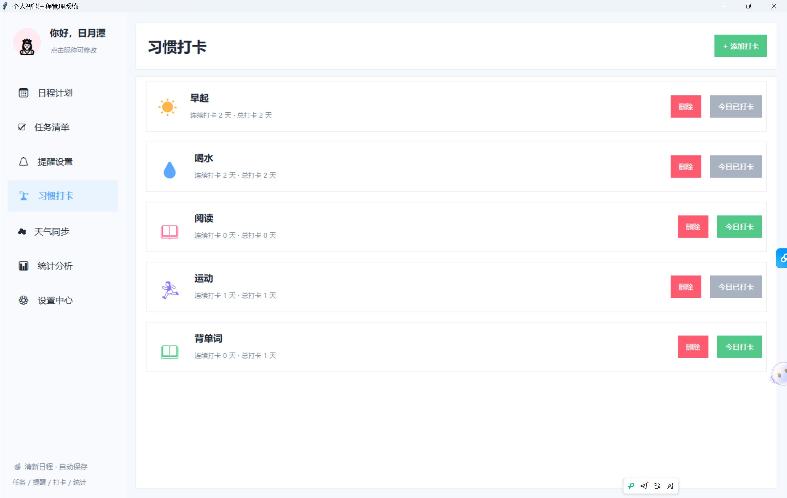
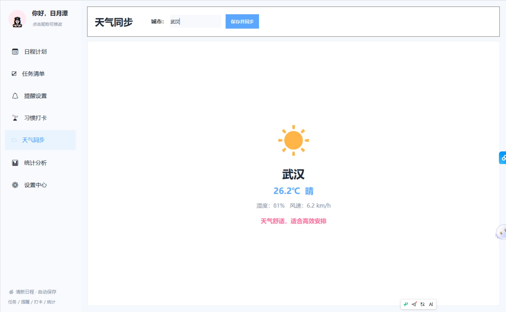
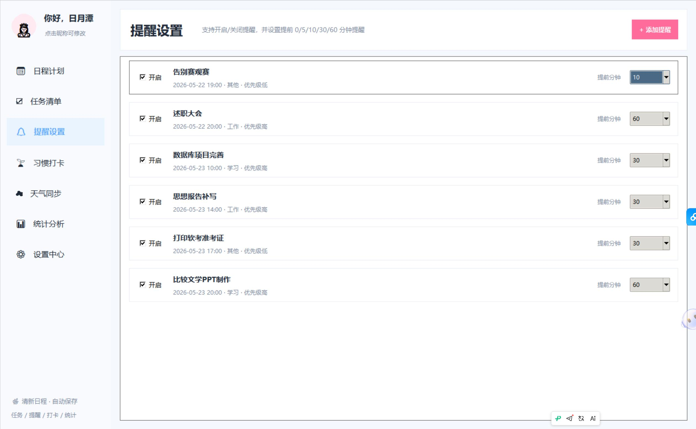
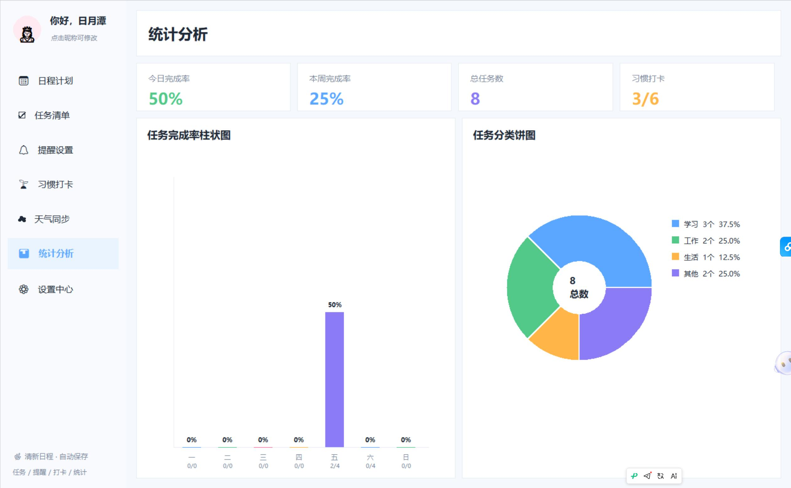
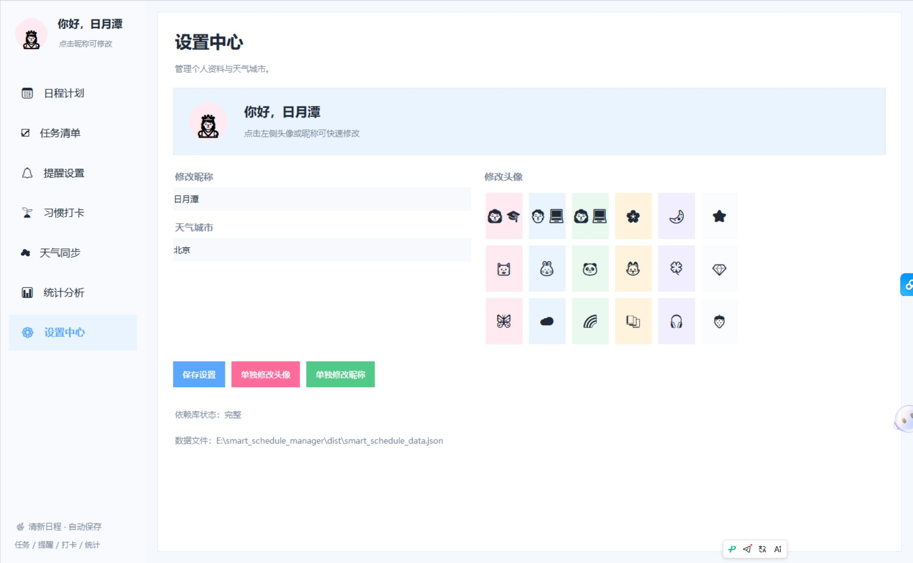

# 个人智能日程管理系统

一款基于 Python + Tkinter 开发的桌面端日程管理工具，集成了任务管理、习惯打卡、日历视图、天气同步、提醒设置、统计分析与个性化配置等功能，旨在帮助用户更高效地管理日常学习与生活安排。

> 本项目支持本地运行，数据自动保存至 JSON 文件，适合作为课程作业、编程竞赛作品或个人开源项目展示。

---

## 项目简介

随着学习与生活节奏不断加快，如何高效安排任务、养成良好习惯、合理设置提醒，成为许多人日常管理中的核心需求。  
本项目围绕“轻量、直观、可扩展”的设计目标，开发了一款基于桌面端的智能日程管理系统，提供任务记录、状态切换、习惯追踪、提醒管理、天气信息同步和统计分析等能力。

项目采用 `Tkinter` 构建图形界面，配合本地 JSON 数据存储，实现了无需联网也可使用的核心日程管理功能。

---

## ✨功能特点

- **📋任务管理**
  - 新增、编辑、删除日程/任务
  - 支持任务完成状态切换
  - 支持任务备注记录
  - 支持任务颜色分类与可视化展示

- **📅习惯打卡**
  - 支持每日习惯记录
  - 可查看连续打卡情况
  - 便于培养学习、运动、早睡等长期习惯

- **🗓️日历与时间视图**
  - 可视化查看日程安排
  - 结合时间线展示每日任务

- **⏰提醒设置**
  - 支持设置提醒事项
  - 可开启/关闭提醒功能
  - 支持提前提醒时间配置

- **🌤️天气同步**
  - 支持配置城市
  - 可同步天气信息，便于结合天气安排外出或活动

- **📊统计分析**
  - 统计任务完成情况
  - 统计习惯打卡数据
  - 辅助用户了解自身执行效率

- **⚙️个性化设置**
  - 可修改昵称
  - 可设置头像
  - 可调整天气城市等配置项

- **💾本地数据保存**
  - 所有数据自动保存到本地 JSON 文件
  - 程序重启后数据仍可保留

---

## 🖼️ 界面预览

### 主页面


### 任务清单页面


### 习惯打卡页面


### 天气同步页面


### 提醒设置页面


### 统计分析页面


### 设置中心页面


---

## 🛠️ 技术栈

- **Python 3**
- **Tkinter**
- **ttk**
- **requests**
- **pillow**
- **plyer**

---

## 🚀 快速开始

### 1. 克隆项目

```bash
git clone https://github.com/6443ren/smart-schedule-manager.git
cd smart-schedule-manager

2. 安装依赖
pip install -r requirements.txt
如果你希望手动安装，也可以使用：

pip install requests plyer pillow
3. 运行项目
python smart_schedule_manager.py


📦 项目结构
smart-schedule-manager/
├── assets/
│   └── screenshots/
│       ├── home.png
│       ├── 主页面.png
│       ├── 任务清单页面.png
│       ├── 习惯打卡页面.png
│       ├── 天气同步页面.png
│       ├── 提醒设置页面.png
│       ├── 统计分析页面.png
│       └── 设置中心页面.png
├── .gitignore
├── LICENSE
├── README.md
├── requirements.txt
└── smart_schedule_manager.py
